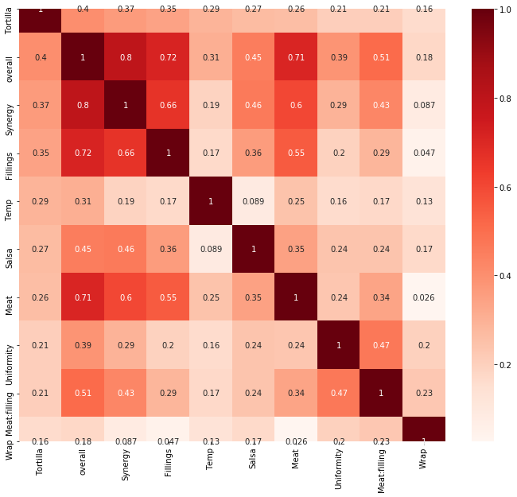
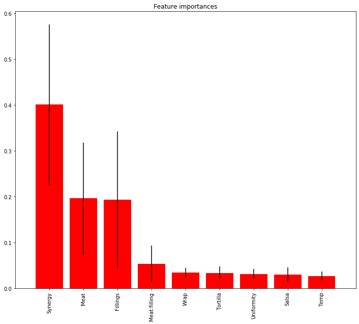
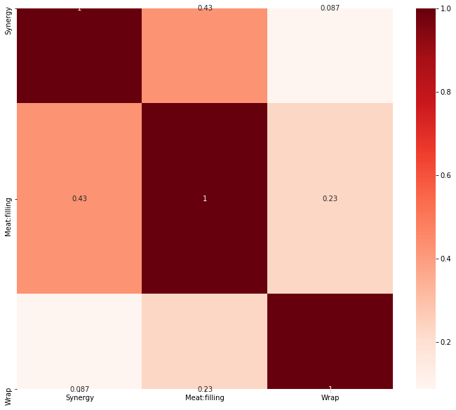
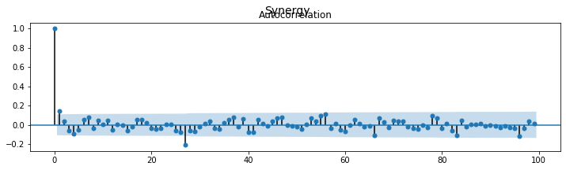
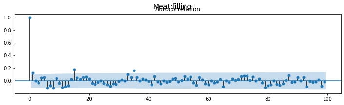
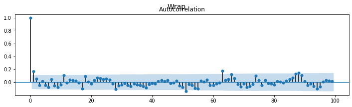
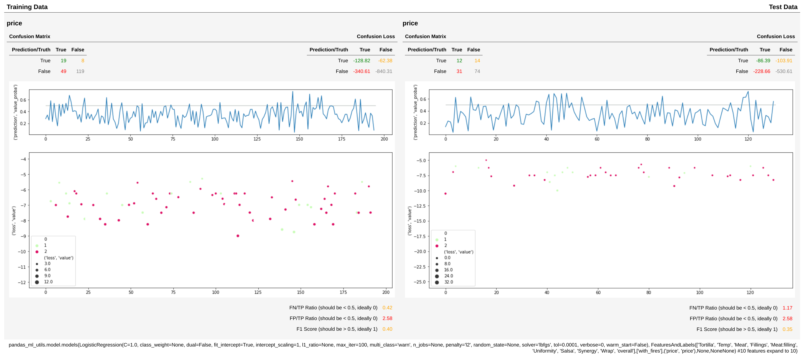

# Pandas ML Utils

Pandas ML Utils is intended to help you through your journey of applying statistical oder machine learning models to data while you never need to leave the world of pandas.

1. install
1. analyze your features
1. find a model
1. save and reuse your model

## Install
```bash
pip install pandas-ml-utils
```

## Analyze your Features

The feature_selection functionality helps you to analyze your features, filter out highly correlated once and focus on the most important features. This function also applies an auto regression and embeds and ACF plot.


```python
import pandas_ml_utils as pmu
import pandas as pd

df = pd.read_csv('burritos.csv')[["Tortilla", "Temp", "Meat", "Fillings", "Meat:filling", "Uniformity", "Salsa", "Synergy", "Wrap", "overall"]]
df.feature_selection(label_column="overall")

```





              Tortilla   overall   Synergy  Fillings      Temp     Salsa  \
    Tortilla       1.0  0.403981  0.367575  0.345613  0.290702  0.267212   
    
                  Meat  Uniformity  Meat:filling      Wrap  
    Tortilla  0.260194    0.208666      0.207518  0.160831  
    label is continuous: True





    Feature ranking:
    ['Synergy', 'Meat', 'Fillings', 'Meat:filling', 'Wrap', 'Tortilla', 'Uniformity', 'Salsa', 'Temp']
    
    TOP 5 features
             Synergy      Meat  Fillings  Meat:filling     Wrap
    Synergy      1.0  0.601545  0.663328      0.428505  0.08685
    
    filtered features with correlation < 0.5
               Synergy  Meat:filling      Wrap
    Tortilla  0.367575      0.207518  0.160831








    Synergy       1.000000
    Synergy_0     1.000000
    Synergy_1     0.147495
    Synergy_56    0.128449
    Synergy_78    0.119272
    Synergy_55    0.111832
    Synergy_79    0.086466
    Synergy_47    0.085117
    Synergy_53    0.084786
    Synergy_37    0.084312
    Name: Synergy, dtype: float64





    Meat:filling       1.000000
    Meat:filling_0     1.000000
    Meat:filling_15    0.185946
    Meat:filling_35    0.175837
    Meat:filling_1     0.122546
    Meat:filling_87    0.118597
    Meat:filling_33    0.112875
    Meat:filling_73    0.103090
    Meat:filling_72    0.103054
    Meat:filling_71    0.089437
    Name: Meat:filling, dtype: float64





    Wrap       1.000000
    Wrap_0     1.000000
    Wrap_63    0.210823
    Wrap_88    0.189735
    Wrap_1     0.169132
    Wrap_87    0.166502
    Wrap_66    0.146689
    Wrap_89    0.141822
    Wrap_74    0.120047
    Wrap_11    0.115095
    Name: Wrap, dtype: float64
    best lags are
    [(1, '-1.00'), (2, '-0.15'), (88, '-0.10'), (64, '-0.07'), (19, '-0.07'), (89, '-0.06'), (36, '-0.05'), (43, '-0.05'), (16, '-0.05'), (68, '-0.04'), (90, '-0.04'), (87, '-0.04'), (3, '-0.03'), (20, '-0.03'), (59, '-0.03'), (75, '-0.03'), (91, '-0.03'), (57, '-0.03'), (46, '-0.02'), (48, '-0.02'), (54, '-0.02'), (73, '-0.02'), (25, '-0.02'), (79, '-0.02'), (76, '-0.02'), (37, '-0.02'), (71, '-0.02'), (15, '-0.02'), (49, '-0.02'), (12, '-0.02'), (65, '-0.02'), (40, '-0.02'), (24, '-0.02'), (78, '-0.02'), (53, '-0.02'), (8, '-0.02'), (44, '-0.01'), (45, '0.01'), (56, '0.01'), (26, '0.01'), (82, '0.01'), (77, '0.02'), (22, '0.02'), (83, '0.02'), (11, '0.02'), (66, '0.02'), (31, '0.02'), (80, '0.02'), (92, '0.02'), (39, '0.03'), (27, '0.03'), (70, '0.04'), (41, '0.04'), (51, '0.04'), (4, '0.04'), (7, '0.05'), (13, '0.05'), (97, '0.06'), (60, '0.06'), (42, '0.06'), (96, '0.06'), (95, '0.06'), (30, '0.07'), (81, '0.07'), (52, '0.07'), (9, '0.07'), (61, '0.07'), (84, '0.07'), (29, '0.08'), (94, '0.08'), (28, '0.11')]


## Find a Model


```python
import pandas as pd
import pandas_ml_utils as pmu
from sklearn.linear_model import LogisticRegression

df = pd.read_csv('burritos.csv')
df["with_fires"] = df["Fries"].apply(lambda x: str(x).lower() == "x")
df["price"] = df["Cost"] * -1
df = df[["Tortilla", "Temp", "Meat", "Fillings", "Meat:filling", "Uniformity", "Salsa", "Synergy", "Wrap", "overall", "with_fires", "price"]].dropna()
fit = df.fit_classifier(pmu.SkitModel(LogisticRegression(solver='lbfgs'),
                                      pmu.FeaturesAndLabels(["Tortilla", "Temp", "Meat", "Fillings", "Meat:filling",
                                                             "Uniformity", "Salsa", "Synergy", "Wrap", "overall"],
                                                            ["with_fires"],
                                                            targets=("price", "price"))))

fit
```




## Save and use your model


```python
fit.save_model("/tmp/burrito.model")
```


```python
df = pd.read_csv('burritos.csv')
df["price"] = df["Cost"] * -1
df = df[["Tortilla", "Temp", "Meat", "Fillings", "Meat:filling", "Uniformity", "Salsa", "Synergy", "Wrap", "overall", "price"]].dropna()
df.classify(pmu.Model.load("/tmp/burrito.model")).tail()
```

<div>
<style scoped>
    .dataframe tbody tr th:only-of-type {
        vertical-align: middle;
    }

    .dataframe tbody tr th {
        vertical-align: top;
    }

    .dataframe thead tr th {
        text-align: left;
    }
</style>
<table border="1" class="dataframe">
  <thead>
    <tr>
      <th></th>
      <th colspan="3" halign="left">price</th>
    </tr>
    <tr>
      <th></th>
      <th colspan="2" halign="left">prediction</th>
      <th>target</th>
    </tr>
    <tr>
      <th></th>
      <th>value</th>
      <th>value_proba</th>
      <th>value</th>
    </tr>
  </thead>
  <tbody>
    <tr>
      <th>380</th>
      <td>False</td>
      <td>0.251311</td>
      <td>-6.85</td>
    </tr>
    <tr>
      <th>381</th>
      <td>False</td>
      <td>0.328659</td>
      <td>-6.85</td>
    </tr>
    <tr>
      <th>382</th>
      <td>False</td>
      <td>0.064751</td>
      <td>-11.50</td>
    </tr>
    <tr>
      <th>383</th>
      <td>False</td>
      <td>0.428745</td>
      <td>-7.89</td>
    </tr>
    <tr>
      <th>384</th>
      <td>False</td>
      <td>0.265546</td>
      <td>-7.89</td>
    </tr>
  </tbody>
</table>
</div>


## TODO
* allow multiple class for classification 
* replace hard coded summary objects by a summary provider function 
* add more tests
* add Proximity https://stats.stackexchange.com/questions/270201/pooling-levels-of-categorical-variables-for-regression-trees/275867#275867

## Wanna help?
* currently I only need binary classification
    * maybe you want to add a feature for multiple classes
* for non classification problems you might want to augment the `Summary` 
* write some tests
* add different more charts for a better understanding/interpretation of the models
* implement hyper parameter tuning
* add feature importance 

## Change Log
### 0.0.12
* added sphinx documentation
* added multi model as regular model which has quite a big impact
  * features and labels signature changed
  * multiple targets has now the consequence that a lot of things a returning a dict now
  * everything is using now DataFrames instead of arrays after plain model invoke
* added some tests
* fixed some bugs a long the way

### 0.0.11
* Added Hyper parameter tuning 
```python
from hyperopt import hp

fit = df.fit_classifier(
            pdu.SkitModel(MLPClassifier(activation='tanh', hidden_layer_sizes=(60, 50), random_state=42),
                          pdu.FeaturesAndLabels(features=['vix_Close'], labels=['label'],
                                                targets=("vix_Open", "spy_Volume"))),
            test_size=0.4,
            test_validate_split_seed=42,
            hyper_parameter_space={'alpha': hp.choice('alpha', [0.001, 0.1]), 'early_stopping': True, 'max_iter': 50,
                                   '__max_evals': 4, '__rstate': np.random.RandomState(42)})
```
NOTE there is currently a bug in hyperot [module bson has no attribute BSON](https://github.com/hyperopt/hyperopt/issues/547)
! However there is a workaround:
```bash
sudo pip uninstall bson
pip install pymongo
``` 

### 0.0.10
* Added support for rescaling features within the auto regressive lags. The following example
re-scales the domain of min/max(featureA and featureB) to the range of -1 and 1. 
```python
FeaturesAndLabels(["featureA", "featureB", "featureC"],
                  ["labelA"],
                  feature_rescaling={("featureA", "featureC"): (-1, 1)})
```
* added a feature selection functionality. When starting from scratch this just helps
to analyze the data to find feature importance and feature (auto) correlation.
I.e. `df.filtration(label_column='delta')` takes all columns as features exept for the
delta column (which is the label) and reduces the feature space by some heuristics.
