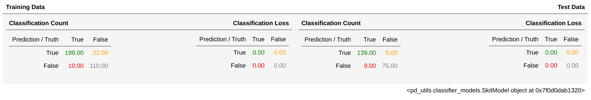
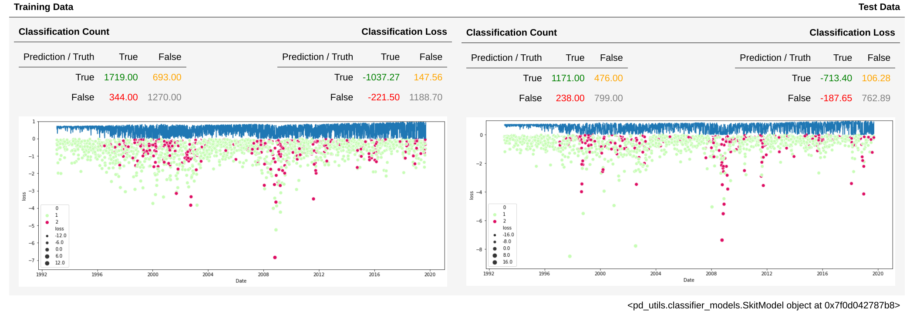

# pandas-ml-utils

**A note of caution**: this is a one man show hobby project in pre-alpha state mainly 
 serving my own needs. Be my guest and use it or extend it. 

I was really sick of converting data frames to numpy arrays back and forth just to try out a 
 simple logistic regression. So I have started a pandas ml utilities library where
 everything should be reachable from the data frame itself. Something along the lines
 `model = df.fit(my_super_model)`

Provided utils include:
 * basic feature analysis / selection
 * fit various kinds of models directly from data frames 
    * fit binary classifiers 
    * fit regression models
    * fit reinforcement agents
 * develop, save, load and deploy models
 
Check the [component tests](https://github.com/KIC/pandas_ml_utils/blob/master/test/component_test.py) for some more 
 concrete examples. 
 
## Basic Feature Analysis / Selection
TODO ... write this stuff 

## Fitting Models Directly from DataFrames 

### Binary Classification
```python
import pandas as pd
import pandas_ml_utils as pmu
from sklearn.datasets import load_breast_cancer
from sklearn.linear_model import LogisticRegression

bc = load_breast_cancer()

df = pd.DataFrame(bc.data, columns = bc.feature_names)
df["label"] = bc.target


fit = df.fit_classifier(pmu.SkitModel(LogisticRegression(solver='lbfgs', max_iter=300),
                                      pmu.FeaturesAndLabels(features=['mean radius', 'mean texture', 'mean perimeter', 'mean area', 
                                                                      'worst concave points', 'worst fractal dimension'],
                                                            labels=['label'])),
                        test_size=0.4)
``` 

As a result you get a Fit object which holds the fitted model and two ClassificationSummary.
 One for the training data and one for the test Data. In case of the classification was
 executed in a notebook you get a nice table:



### Binary Classification with Loss
As you can see in the above example are two confusion matrices the regular well known one 
 and a "loss". The intend of loss matrix is to tell you if a miss classification has a cost
 i.e. a loss in dollars. 
```python
import pandas as pd
import pandas_ml_utils as pmu
from sklearn.linear_model import LogisticRegression

df = pd.fetch_yahoo(spy='SPY')
df["label"] = df["spy_Close"] > df["spy_Open"]
df["loss"] = (df["spy_Open"] / df["spy_Close"] - 1) * 100

fit = df.fit_classifier(pmu.SkitModel(LogisticRegression(solver='lbfgs'),
                                      pmu.FeaturesAndLabels(features=['spy_Open', 'spy_Low'],
                                                            labels=['label'],
                                                            loss_column='loss')),
                        test_size=0.4)
```


         
Now you can see the loss in % of dollars of your miss classification. The classification
 probabilities are plotted on the very top of the plot.

### Autoregressive Models and RNN Shape
It is also possible to use the FeaturesAndLabels object to generate autoregressive 
 features. By default lagging features results in an RNN shaped 3D array (in the format
 as Keras likes it). However we can also use SkitModels the features will be implicitly 
 transformed back into a 2D array (by using the `reshape_rnn_as_ar` function).  

```python
import pandas_ml_utils as pmu
pmu.FeaturesAndLabels(features=['feature'],
                      labels=['label'],
                      feature_lags=range(0, 10))
```

One may like to use very long lags i.e. to catch seasonal effects. Since very long lags
are a bit fuzzy I usually like to smooth them a bit by using simple averages.

```python
import pandas_ml_utils as pmu
pmu.FeaturesAndLabels(features=['feature'], 
                      labels=['label'], 
                      target_columns=['strike'],
                      loss_column='put_loss',
                      feature_lags=[0, 1, 2, 3, 5, 8, 13, 21, 34, 55, 89, 144, 233],
                      lag_smoothing={
                          6: lambda df: df.SMA(3, price=df.columns[0]),
                          35: lambda df: df.SMA(5, price=df.columns[0])
                      })
```

Every lag from 6 onwards will be smoothed by a 3 period average, every lag from 35 onwards
 with a 5 periods moving average.
 
## Cross Validation
It is possible to apply a cross validation algorithm to the training data (after the train
 test split). In case you only want cross validation pass `test_size=0`
 
Note that the current implementation is just fitting the models on all folds one after the
 other without any averaging of the validation loss. However the folds can be looped many
 times which essentially means we invented something like fold epochs. Therefore your fitter
 epochs can be reduced by division of the number of fold epochs.
 
```python
from sklearn.model_selection import KFold

cv = KFold(n_splits = 10)
fit = df.fit_classifier(...,
                        SomeModel(epochs=100/10),
                        test_size=0.1 # keep 10% very unseen
                        cross_validation=(10, cv.split), 
                        ...)
```  

## Back-Testing a Model
todo ... `df.backtest_classifier(...)`

## Save, load reuse a Model
To save a model you simply call the save method on the model inside of the fit.
```
fit.model.save('/tmp/foo.model')
```

Loading is as simply as calling load on the Model object. You can immediately apply
 the model on the dataframe to get back the features along with the classification
 (which is just another data frame).

```python

import pandas as pd
import pandas_ml_utils as pmu
from sklearn.datasets import load_breast_cancer

bc = load_breast_cancer()
df = pd.DataFrame(bc.data, columns = bc.feature_names)

df.classify(pmu.Model.load('/tmp/foo.model')).tail()
```  

NOTE If you have a target level for your binary classifier like all houses cheaper then
 50k then you can define this target level to the FeaturesAndLabels object likes so:
 `FeaturesAndLabels(target_columns=['House Price'])`. This target column is simply fed 
 through to the classified dataframe as target columns.
 
### Fitting other models then classifiers
#### Regression Models
For non classification tasks use the regressor functions the same way as the classifier 
 functions.
 
* df.fit_regressor(...)
* df.backtest_regressor(...)
* df.regress(...)
 
#### Reinforcement Learning
For reinforcement learning there is a keras-rl backend implemented. The API is the same
 as for the others like classification or regression.
 
* df.fit_agent(...)
* df.backtest_agent(...)
* df.agent_take_action(...)

However the model is a bit more complicated as the regular SkitModel, you might take a look
 at the [component tests](https://github.com/KIC/pandas_ml_utils/blob/master/test/component_test.py). 
  
### Other utility objects
#### LazyDataFrame
Very often I need to do a lot of feature engineering. And very often I do not want to
 treat averages or other engineering methods as part of the data(frame). For this use
 case I have added a LazyDataFrame object wrapping around a regular DataFrame where
 some columns will always be calculated on the fly.
 
Here is an example:
```python
import pandas_ml_utils as pmu
import pandas as pd
import talib

df = pd.fetch_yahoo(spy='SPY')
ldf = pmu.LazyDataFrame(df,
                        rolling_stddev=lambda x: talib.STDDEV(x['spy_Close'], timeperiod=30) / 100)

ldf["rolling_stddev"].tail()  # Will always be calculated only the fly    
```   

#### HashableDataFrame
The hashable dataframe is nothing which should be used directly. However this is just a 
hack to allow caching of feature matrices. With heavy usage of LazyDataFrame and heavily 
lagging of features for AR models the training data preparation might take a long time.
To shorten this time i.e. for hyper parameter tuning a cache is very helpful (but keep
in mind this is still kind of a hack).

to set the cache size (default is 1) set the following environment variable before import
 `os.environ["CACHE_FEATUES_AND_LABELS"] = "2"`. And to use the cache simply pass the 
 argument to the fit_classifier method like so:`df.fit_classifier(..., cache_feature_matrix=True)`
 
#### MultiModel
TODO describe multi models ... 

## TODO
* replace hard coded summary objects by a summary provider function 
* multi model is just another implementation of model
* add documentation ([read the docs](https://docs.readthedocs.io/en/stable/intro/getting-started-with-sphinx.html))
* add more tests
* add Proximity https://stats.stackexchange.com/questions/270201/pooling-levels-of-categorical-variables-for-regression-trees/275867#275867

## Wanna help?
* currently I only need binary classification
    * maybe you want to add a feature for multiple classes
* for non classification problems you might want to augment the `Summary` 
* write some tests
* add different more charts for a better understanding/interpretation of the models
* implement hyper parameter tuning
* add feature importance 

## Change Log
### 0.0.10
* Added support for rescaling features within the auto regressive lags. The following example
re-scales the domain of min/max(featureA and featureB) to the range of -1 and 1. 
```python
FeaturesAndLabels(["featureA", "featureB", "featureC"],
                  ["labelA"],
                  feature_rescaling={("featureA", "featureC"): (-1, 1)})
```
* added a feature selection functionality. When starting from scratch this just helps
to analyze the data to find feature importance and feature (auto) correlation.
I.e. `df.filtration(label_column='delta')` takes all columns as features exept for the
delta column (which is the label) and reduces the feature space by some heuristics.
